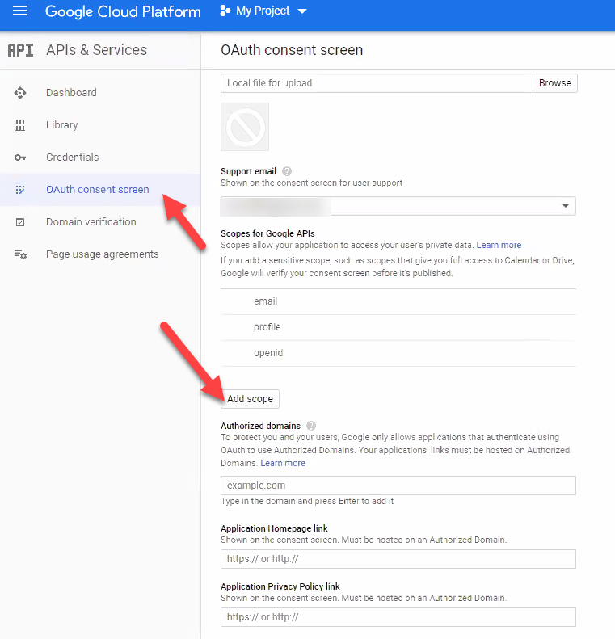
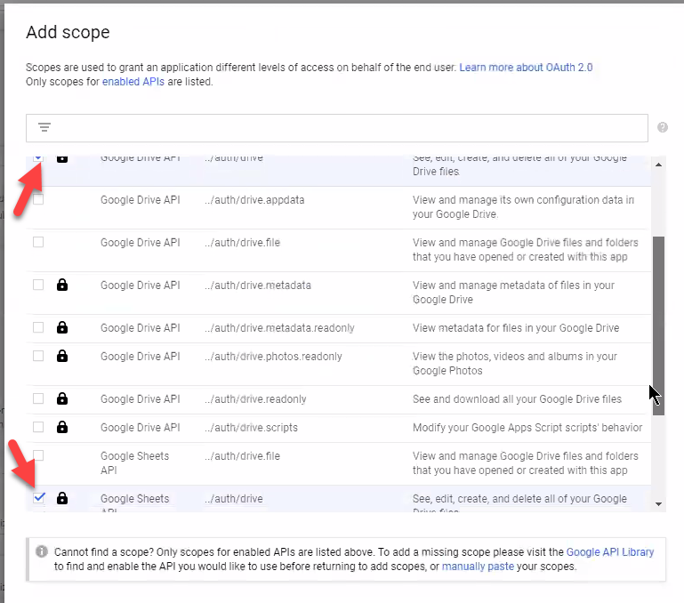
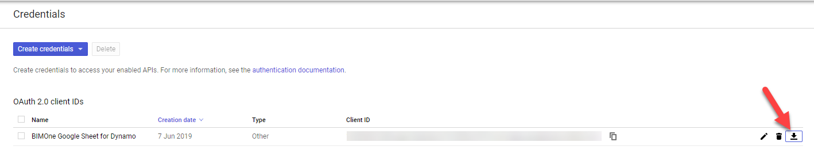
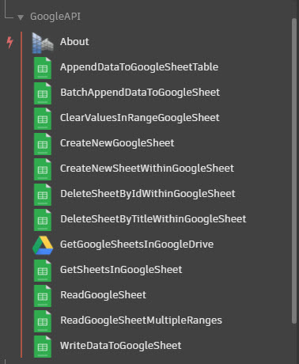

# BIMOne.GoogleSheets
A set of Dynamo nodes to facilitate interactions with Google Sheets.

## A word of caution
__Be very careful what you pass into these nodes.__ If you pass a list of spreadsheet IDs into certain nodes, Dynamo will run the node once per item in that list. For example, if you were to use the `AppendDataToGoogleSheetTable` node and pass in a list of spreadsheet IDs, Dynamo will append your data once for __*every*__ Google Sheet in that list.

Also, be careful not to confuse the concept of a Google Sheet (the entire spreadsheet) and a "sheet" within that spreadsheet.

## Installation & Config
1. Get the package installed from https://dynamopackages.com/
2. Create Google API credentials for your use:
    1. Create a [Google APIs Console project](https://console.cloud.google.com).
    2. [Enable the Google Drive API and Google Sheets API](https://support.google.com/googleapi/answer/6158841?hl=en&ref_topic=7013279) on this project.
    3. Create OAuth [Google API credentials](https://console.developers.google.com/apis/credentials). When asked for the type of application choose "other". 
    4. Add at least the following [scopes enabled](https://support.google.com/a/answer/162106?hl=en):
        - `../auth/spreadsheets`
        - `../auth/drive`
        
        
    5. Download the credentials file (JSON):
    
        
    6. Rename the file to `credentials.json`
    7. Place the credentials.json file in the `/extra` folder where you installed the package. For Dynamo X.X with locally installed packages, this would typically be `%appdata%\Dynamo\Dynamo Revit\X.X\packages\BIMOneGoogleAPI\extra`
3. Keep an eye on the [Google Sheets API usage limits](https://developers.google.com/sheets/api/limits).

## Usage
The package provides the following nodes:

| Node name  | Use |
| --- | --- |
| GetGoogleSheetsInGoogleDrive | Get a list of all the Google Sheets that you can see in you Google Drive. Optionally, pass a string to the filter parameter to narrow down the list of results. |
| GetSheetsInGoogleSheet | Get a list of the sheets (aka those "tabs" at the bottom) within a Google Sheet. |
| ReadGoogleSheet | Read a specific range within a sheet within a spreadsheet. Optionally return raw values using `unformattedValues` |
| ReadGoogleSheetMultipleRanges | Read multiple ranges within a spreadsheet. Format of each range in the input list must be `SheetTitle!A:Z`. Optionally return raw values using `unformattedValues` |
| CreateNewGoogleSheet | Create a new Google Sheet (name must not already exist in your Drive) and optionally open it in the browser using `openInBrowser` boolean |
| CreateNewSheetWithinGoogleSheet | Create a new sheet (or tab) within a spreadsheet. |
| BatchAppendDataToGoogleSheet | This is the __preferred way of writing data__. It will optimize the number of requests needed to write the data to the Sheets. It will append the data at the end of each sheet passed in. Take a list of sheets (tabs) and a matching data input (A list of lists of lists containing the data to append to the table in Google Sheets. Outer list corresponds to sheets, first inner to rows and innermost to columns within the rows).|
| AppendDataToGoogleSheet | Similar to the batch append but allows to specify a range and is simpler to user. __However, it is not optimized for large chunks of data (will create many requests)__|
| WriteDataToGoogleSheet | Will write data to sheet starting at the specified range. __Warning: it will overwrite data.__ To be safe start by using BatchAppend instead |
| ClearValuesInRangeGoogleSheet | __Use with caution__ Clears the values within the given search range. Optionally, provide a search string. If the search string is present and a match is found (case sensitive but partial matches are valid) then the entire row where that cell was found will be deleted. |
| DeleteSheetByIdWithinGoogleSheet | Deletes a sheet/tab within a spreadsheet based on the id passed in. |
| DeleteSheetByTitleWithinGoogleSheet | Deletes a sheet/tab within a spreadsheet based on the title passed in. |

## Need help setting it up?
[Contact us](https://bimone.com/en/ContactUs), we will be glad to help!
